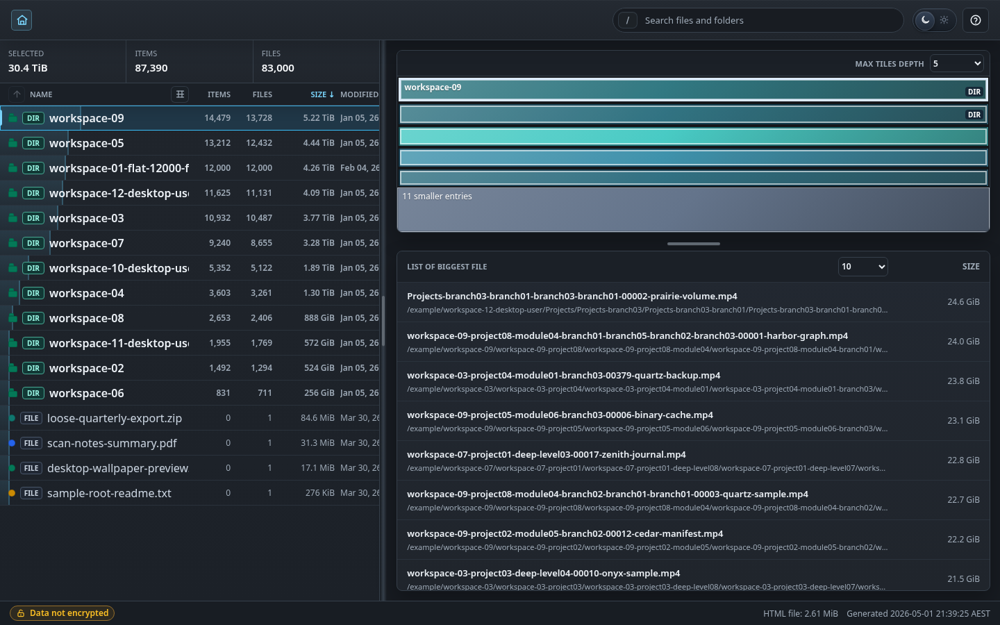

# webdiskstat - gdu and ncdu web disk usage viewer

`webdiskstat` converts JSON from [`gdu -o-`](https://github.com/dundee/gdu) or [`ncdu -o-`](https://dev.yorhel.nl/ncdu) into a self-contained disk usage HTML report you can open in a browser. It works as a lightweight `gdu` web UI and `ncdu` web viewer with a WinDirStat-style directory list, browser treemap, navigation, optional compression, and optional encryption. [Try the live example report](https://htmlpreview.github.io/?https://github.com/rwahyudi/webdiskstat/blob/main/example/report.html) to see the browser UI before generating your own.

Use it to view `gdu` output in a browser, share `ncdu` results as a static HTML report, or publish an offline disk usage treemap without running a web server.

## Requirements

- Python 3.10 or newer
- [`gdu`](https://github.com/dundee/gdu) or [`ncdu`](https://dev.yorhel.nl/ncdu)

## Features

- Converts `gdu -o-` JSON by default and supports `ncdu -o-` JSON with `--input-type ncdu`.
- Reads scanner JSON from stdin, a saved JSON file, or a `.gz` file, and writes a single self-contained disk usage HTML report with an embedded favicon.
- Embeds scan data as a gzip-compressed compact string-table payload to keep generated reports smaller.
- Optionally encrypts embedded scan data with `--password` using PBKDF2-SHA256 and ChaCha20-Poly1305.
- Encrypted reports prompt for a password in the browser before loading scan data.
- Encrypted reports use Web Crypto when available and include a JavaScript fallback for `file://` and other non-HTTPS schemes.
- Shows an encrypted or unencrypted data indicator in the footer.
- Virtualizes large directory listings so directories with thousands of entries remain responsive.
- Includes global search backed by a prebuilt index for quickly jumping to files or directories.
- Supports breadcrumb navigation, parent navigation, double-click directory entry, browser back/forward navigation, and bookmarkable URL hashes.
- Supports keyboard navigation with arrow keys, Page Up, Page Down, Home, End, Enter, Backspace, Escape, `?` help, and sort shortcuts.
- Includes a sortable directory list, configurable columns, nested treemap tiles, a configurable treemap tile cap, and a biggest-files view.
- Works as a static report after generation without Python, `gdu`, or `ncdu`.

## Use Cases

- View `gdu` output in a browser as a static disk usage report.
- Share `ncdu` results as a self-contained HTML report.
- Generate an offline browser treemap for a directory scan without running a web server.
- Create an encrypted disk usage report when scan paths or metadata are sensitive.

## Screenshot



## Download and Install

Clone the repository:

```sh
git clone https://github.com/rwahyudi/webdiskstat.git
cd webdiskstat
```

Optional: make it available from your shell path:

```sh
install -Dm755 webdiskstat.py ~/.local/bin/webdiskstat
```

## Quick Start

Generate a `gdu` web report:

```sh
gdu -o- /path/to/scan | ./webdiskstat.py -o diskstats.html
```

Open `diskstats.html` in a browser.

Generate an `ncdu` web report:

```sh
ncdu -o- /path/to/scan | ./webdiskstat.py --input-type ncdu -o diskstats.html
```

Generate a disk usage HTML report from a saved scanner export:

```sh
gdu -o report.json /path/to/scan
./webdiskstat.py report.json -o diskstats.html
```

Read a compressed scanner export:

```sh
./webdiskstat.py report.json.gz -o diskstats.html
```

## Example

Open the included sample report in the repository: [example/report.html](example/report.html).

Preview it in a browser through HTMLPreview: [webdiskstat example report](https://htmlpreview.github.io/?https://github.com/rwahyudi/webdiskstat/blob/main/example/report.html).

The included example uses 83,000 generated files across 12 uneven top-level workspaces and 4 loose root files, including one workspace with 12,000 direct files and three desktop-style user workspaces, so it exercises large-directory navigation and search.

## Options

```text
usage: webdiskstat.py [-h] [--input-type {gdu,ncdu}] [-o OUTPUT] [--password PASSWORD] [input]
```

- `input`: scanner JSON file, `.gz` file, or `-` for stdin. Defaults to stdin.
- `--input-type`: input JSON format, either `gdu` or `ncdu`. Defaults to `gdu`.
- `-o, --output`: output HTML path. Defaults to `webdiskstat.html`.
- `--password PASSWORD`: encrypt the embedded scan data. Defaults to unencrypted.

Running the script without piped input or an input file prints the usage instructions.

## Encryption

Encrypt the embedded report data with `--password`:

```sh
./webdiskstat.py report.json -o diskstats.html --password 'choose-a-strong-password'
```

## Interface

- The left panel lists the current directory entries, including modified time when the scan data provides it.
- Columns are sortable by name, item count, file count, size, and modified date.
- Optional columns can be shown or hidden from the column settings button next to the Name header.
- The toolbar search finds files and directories across the whole report and jumps to the selected result.
- The treemap shows the current directory, including nested subdirectories and files inside larger directory tiles when space allows.
- The treemap shows up to the selected Max Tiles Depth entries per directory before grouping additional entries as smaller entries.
- The divider between the directory list and right panel can be dragged to resize the right panel.
- The home view shows a smaller treemap and a framed biggest-files list.
- The biggest-files list can show 10 to 50 entries and scrolls when the list is taller than the pane.
- The home view divider can be dragged to resize the treemap and biggest-files list.
- Double-click a listed file to jump to the directory containing that file.
- Details show size, percentage, type, extension, item count, file count, and modified time when the scan data provides it.
- The Help button in the toolbar, or the `?` shortcut, explains features, mouse actions, keyboard shortcuts, and navigation.

## Navigation

- Breadcrumbs, the parent button, and browser back/forward move between directories.
- Use the search box, `/`, or `Ctrl+F` to find files and directories across the report.
- Double-click a directory row or treemap tile to enter it.
- Double-click a biggest-files row to jump to the directory containing that file.
- The URL hash changes as you navigate, so directory views are bookmarkable.
- `Arrow Up` / `Arrow Down`: move selection in the directory list.
- `Page Up` / `Page Down`: move selection by one visible page.
- `Home` / `End`: jump to the first or last item.
- `Enter` / `Arrow Right`: enter the selected directory.
- `Backspace` / `Arrow Left`: go up one directory.
- `n` / `s` / `C` / `M` or `m`: sort by name, size, file count, or modified time. Repeating the same shortcut toggles ascending or descending order.
- `?`: open the Help dialog.

## Compression and Security

The output is a static browser disk usage report. After generation, it does not need Python, `gdu`, or `ncdu` to view the report.

- Scan data is normalized into a compact string-table payload, gzip-compressed, embedded in the HTML, and expanded by the browser when the report loads.
- The generated file is a compressed HTML disk usage report rather than a server-backed web app.
- Viewing generated reports requires a browser with the standard `DecompressionStream` API.
- Encrypted disk usage reports prompt for the password before loading scan data.
- Encryption uses PBKDF2-SHA256 key derivation and ChaCha20-Poly1305 payload encryption.
- Reports use the browser Web Crypto API when available and include a slower JavaScript fallback for `file://` and other non-HTTPS schemes.
- Unencrypted reports disclose the scan metadata embedded in the HTML.
- Encrypted reports still depend on password strength, and command-line passwords may be visible in shell history or process lists.
