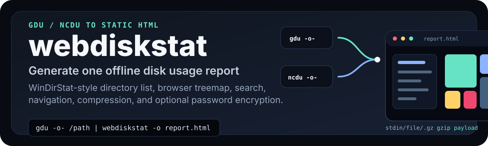
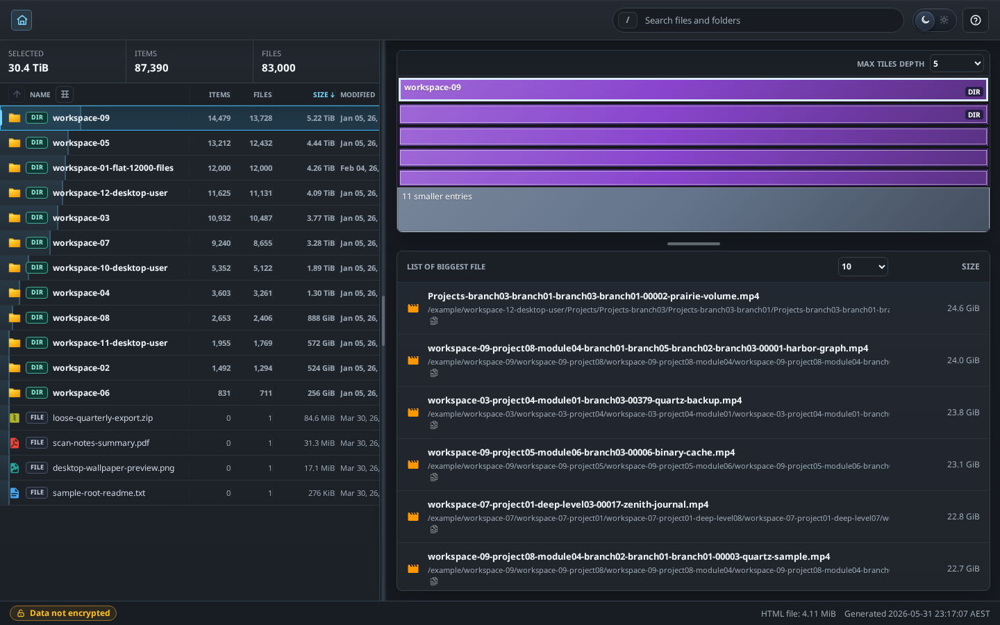

<p align="center">
  
</p>

# webdiskstat

`webdiskstat` converts JSON from [`gdu -o-`](https://github.com/dundee/gdu) or [`ncdu -o-`](https://dev.yorhel.nl/ncdu) into a self-contained disk usage HTML report you can open in a browser. It gives scanner output a WinDirStat-style directory list, browser treemap, search, keyboard navigation, a compressed embedded payload, and optional password encryption without running a web server.

[Try the live example report](https://htmlpreview.github.io/?https://github.com/rwahyudi/webdiskstat/blob/main/example/report.html) before generating your own.

## See It



The included example uses 83,000 generated files across 12 uneven top-level workspaces and 4 loose root files, including one workspace with 12,000 direct files, so it exercises large-directory navigation and search.

## Quick Start

Generate a `gdu` report:

```sh
gdu -o- /path/to/scan | webdiskstat -o diskstats.html
```

Open `diskstats.html` in a browser. The report is a static HTML file with no network dependencies, so it can be viewed offline or shared as a single artifact.

## Download and Install

Download a release package from [GitHub Releases](https://github.com/rwahyudi/webdiskstat/releases/latest).

Linux x86-64:

```sh
curl -L -o webdiskstat-linux-amd64.tar.gz https://github.com/rwahyudi/webdiskstat/releases/latest/download/webdiskstat-linux-amd64.tar.gz
tar -xzf webdiskstat-linux-amd64.tar.gz
install -Dm755 webdiskstat ~/.local/bin/webdiskstat
```

Verify a downloaded release before installing it:

```sh
curl -LO https://github.com/rwahyudi/webdiskstat/releases/latest/download/SHA256SUMS
sha256sum --ignore-missing -c SHA256SUMS
```

Windows x86-64 PowerShell:

```powershell
Invoke-WebRequest -Uri https://github.com/rwahyudi/webdiskstat/releases/latest/download/webdiskstat-windows-amd64.zip -OutFile webdiskstat-windows-amd64.zip
Expand-Archive .\webdiskstat-windows-amd64.zip -DestinationPath .
.\webdiskstat.exe --help
```

## Features

| Area | What it does |
| --- | --- |
| Inputs | Reads `gdu -o-` JSON by default, `ncdu -o-` JSON with `--input-type ncdu`, stdin, saved JSON files, and `.gz` exports. |
| Output | Writes one self-contained HTML disk usage report with embedded scan data, fonts, icons, and favicon. |
| Browser UI | Provides sortable columns, configurable visible columns, nested treemap tiles, breadcrumb navigation, browser back/forward support, bookmarkable URL hashes, and a biggest-files view. |
| Scale | Virtualizes large directory listings, keeps the 50 largest files, and builds a compact global search index only when search is first used. Search is disabled above 5,000,000 files or a 512-million-character index budget to protect browser memory. |
| Security | Can encrypt embedded scan data with `--password` using PBKDF2-SHA256 and ChaCha20-Poly1305. Encrypted reports prompt for the password in the browser. |
| Offline use | Generated reports work as static files after generation without Go, `gdu`, `ncdu`, or a web server. |

## More Examples

Generate an `ncdu` web report:

```sh
ncdu -o- /path/to/scan | webdiskstat --input-type ncdu -o diskstats.html
```

Generate a disk usage HTML report from a saved scanner export:

```sh
gdu -o report.json /path/to/scan
./webdiskstat report.json -o diskstats.html
```

Read a compressed scanner export:

```sh
./webdiskstat report.json.gz -o diskstats.html
```

## Options

```text
usage: webdiskstat [--input-type gdu|ncdu] [-o OUTPUT] [--password PASSWORD] [input]
```

- `input`: scanner JSON file, `.gz` file, or `-` for stdin. Defaults to stdin.
- `--input-type`: input JSON format, either `gdu` or `ncdu`. Defaults to `gdu`.
- `-o, --output`: output HTML path, or `-` for stdout. Defaults to `webdiskstat.html`. Parent directories are created automatically; an existing output file is replaced.
- `--password PASSWORD`: encrypt the embedded scan data. Defaults to unencrypted.
- `-v, --version`: print the version and the build date in local time.

Running the command without piped input or an input file prints the usage instructions. Argument errors use exit status 2; input, conversion, and output errors use exit status 1.

## Encryption

Encrypt the embedded report data with `--password`:

```sh
./webdiskstat report.json -o diskstats.html --password 'choose-a-strong-password'
```

Encrypted reports use Web Crypto when available and include a JavaScript fallback for `file://` and other non-HTTPS schemes. Unencrypted reports disclose the scan metadata embedded in the HTML, and encrypted reports still depend on password strength.

## Interface

- The left panel lists the current directory entries, including modified time when the scan data provides it.
- Columns are sortable by name, item count, file count, size, and modified date.
- Optional columns can be shown or hidden from the column settings button next to the Name header.
- The toolbar search finds files and directories across the whole report and jumps to the selected result. Its compact node-reference index is built only when search is first used and is disabled above 5,000,000 files or a 512-million-character index budget.
- The treemap shows the current directory, including nested subdirectories and files inside larger directory tiles when space allows.
- The home view shows a smaller treemap and a framed biggest-files list.
- Details show size, percentage, type, extension, item count, file count, and modified time when the scan data provides it.
- The Help button in the toolbar, or the `?` shortcut, explains mouse actions, keyboard shortcuts, and navigation.

## Navigation

- Breadcrumbs, the parent button, and browser back/forward move between directories.
- Use the search box, `/`, or `Ctrl+F` to find files and directories across the report.
- Double-click a directory row or treemap tile to enter it. Keyboard users can focus rows or tiles and press `Enter` or `Space`.
- Double-click a file or largest-files row to jump to the directory containing that file.
- The URL hash changes as you navigate, so directory views are bookmarkable.
- `Arrow Up` / `Arrow Down`: move selection in the directory list.
- `Page Up` / `Page Down`: move selection by one visible page.
- `Home` / `End`: jump to the first or last item.
- `Enter` / `Arrow Right`: enter the selected directory.
- `Backspace` / `Arrow Left`: go up one directory.
- `n` / `s` / `C` / `M` or `m`: sort by name, size, file count, or modified time. Repeating the same shortcut toggles ascending or descending order.
- `?`: open the Help dialog.

## Compression and Security

The generated report embeds scan data as a compact string-table payload that is gzip-compressed before being stored in the HTML.

- Viewing generated reports requires a current maintained Chrome, Edge, Firefox, or Safari release with the standard `DecompressionStream` API. Reports are supported when opened directly with `file://`.
- Encrypted reports show an encrypted data indicator in the footer and prompt for the password before loading scan data.
- Encryption uses PBKDF2-SHA256 key derivation and ChaCha20-Poly1305 payload encryption.
- Reports use the browser Web Crypto API when available and include a slower JavaScript fallback for `file://` and other non-HTTPS schemes.
- Unencrypted reports disclose the scan metadata embedded in the HTML.
- Command-line passwords may be visible in shell history or process lists.
- Input is limited to 512 MiB on disk, 1 GiB after decompression, and 5,000,000 normalized nodes. These limits prevent a malformed or compressed export from exhausting memory.

## Build From Source

### Requirements

- Go 1.25 or newer

```sh
git clone https://github.com/rwahyudi/webdiskstat.git
cd webdiskstat
go build -o webdiskstat .
install -Dm755 webdiskstat ~/.local/bin/webdiskstat
```

Set release metadata at build time with linker flags. `-v` prints this value and date; builds without it use the executable's local modification time.

```sh
go build -ldflags "-X main.version=v1.2.3 -X 'main.buildDate=$(date '+%Y-%m-%d %H:%M:%S %Z')'" -o webdiskstat .
```

`gdu` or `ncdu` is required only when creating a new scanner export. It is not required to convert an existing JSON export.
